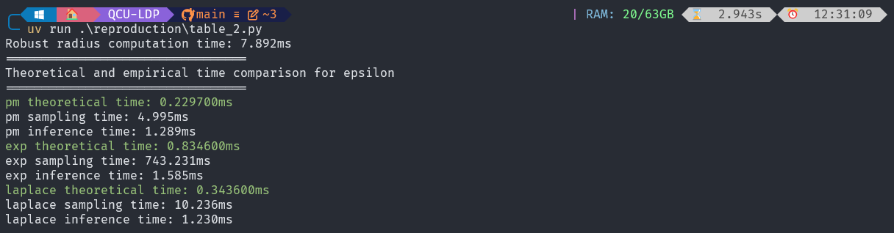

# Artifact Appendix

Paper title: **Quantifying Classifier Utility under Local Differential Privacy**

Requested Badge(s):
  - [x] **Available**
  - [x] **Functional**
  - [x] **Reproduced**

## Description

This paper studies the analytical utility of classifiers on inputs perturbed by local differential privacy (LDP) mechanisms. 
We show that an analytical utility bound can be derived by connecting the concentration property of the LDP mechanism with the robustness property of the classifier. 
We further conduct case studies on typical classifiers, including logistic regression, random forests, and neural networks, under various LDP mechanisms.
This repository is mainly for such case studies.

### Security/Privacy Issues and Ethical Concerns

The artifact does not require any security modifications for installation or execution. Most evaluations are theoretical or comparative in nature. 
The dataset included is small and publicly available, with no sensitive information involved.

## Basic Requirements

### Hardware Requirements

The code has been tested on both Windows desktops and wsl environment (with specifications below). Standard hardware with a typical CPU and 16GB of memory should be sufficient.
- CPU: Intel(R) Core(TM) i9-9900K CPU @ 3.60GHz
- Memory: 64GB RAM with speed 2666 MT/s

### Software Requirements

The software requirements for running the artifact include:

1. Operating System: The artifact has been tested on Windows 11 and Ubuntu 22.04 (WSL). It should also work on other operating systems that support Python and the required dependencies.
2. Artifact packaging: The artifact is a Python project packaged with `uv`.
3. Python version: The artifact is tested with Python 3.13.
4. Dependencies: All dependencies are listed in the `pyproject.toml` file, which can be installed using `uv`. (Will be detailed later.)
We use matplotlib for plotting, which requires a display environment. The virtual machines provided by PETS may not have a display environment, so we recommend running the artifact on your local machine (Windows or WSL or Linux). 
5. Machine learning models: The artifact includes implementations of logistic regression, random forests, and neural networks. These models are included in the codebase and do not require additional software to run.
6. Dataset: The artifact includes `stroke_pred`, `bank_attrition`, and `mnist` datasets, which are included in the repository and do not require additional software to access.

### Estimated Time and Storage Consumption

The estimated time and storage consumption for running the artifact are as follows:

- The overall human and compute times required to run the artifact: Approximately 5 mins for setup and 2.5 hours for running all experiments.
- The overall disk space consumed by the artifact: Approximately 2GB, including the codebase, dependencies, and datasets.

## Environment

### Accessibility

GitHub repository: https://github.com/ZhengYeah/QCU-LDP

### Set up the environment

**Install UV package manager.** This project is packaged by `uv`, a modern Python package management system similar to `miniconda` or `poetry`. You can install `uv` by following the instructions on their official website: https://docs.astral.sh/uv/. (Remember to add `uv` to yout PATH.)

**Clone the repository.** You can clone the repository using the following command:
```bash
git clone https://github.com/ZhengYeah/QCU-LDP.git
cd QCU-LDP
```
You should be in the project root directory, which contains the `pyproject.toml` file. Then, run the following uv command:
```bash
[PROJECT_ROOT]$ uv sync
```
This command creates a virtual environment in the project root with Python version specified `.python-version` file (Python 3.13 in this case), 
and installs the dependencies listed in pyproject.toml.

### Testing the Environment 

To verify that the dependencies have been installed correctly, run the following command from the project root:
```bash
[PROJECT_ROOT]$ uv pip check
```
This will print: all installed packages are compatible.


## Artifact Evaluation

### Main Results and Claims

This artifact mainly supports the following two main results in the paper.

#### Main Result 1: Theoretical Utility vs Empirical Utility

Most of this paper's case studies are showing that the proposed theoretical utility bound is tight and can be used to predict the empirical utility of classifiers under LDP-perturbed inputs,
particularly when the classifier operated in lower-dimensional input space. (Figure 6, 7, 9, 11, 12, 13, 14)
In high-dimensional input space, the theoretical utility bound is still valid but becomes less tight. (Figure 8, 10, 15)

#### Main Result 2: Low Time Complexity of Theoretical Utility

The proposed theoretical utility bound can be computed analytically with low time complexity, better than the time complexity of sampling inputs from the LDP mechanism and evaluating the empirical utility of classifiers on these sampled inputs. (Table 2)

### Experiments

The `reproduction` folder contains scripts to reproduce all results in the paper. 
```
QCU-LDP/ (project root)
├── reproduction/
│   ├── figure_4.py: Figure 4 (Page 7)  (≈5 seconds)
│   ├── figure_6.py: Figure 6 (Page 11)  (≈2 minutes)
│   ├── table_2.py: Table 2 (Page 11)  (≈5 seconds)
│   ├── figure_7.py: Figure 7 (Page 12)  (≈1 minute)
│   ├── figure_8.py: Figure 8 (Page 12)  (≈5 minutes)
│   ├── figure_9.py: Figure 9 (Page 20)  (≈1 minute)
│   ├── figure_10.py: Figure 10 (Page 20)  (≈5 seconds)
│   ├── figure_11_data.py & figure_11_draw.py: Figure 11 (Page 20)  (≈20 minutes)
│   ├── figure_12_data.py & figure_12_draw.py: Figure 12 (Page 20)  (≈30 minutes)
│   ├── figure_13_data.py & figure_13_draw.py: Figure 13 (Page 21)  (≈20 minutes)
│   ├── figure_14_data.py & figure_14_draw.py: Figure 14 (Page 21)  (≈30 minutes)
│   ├── figure_15_data.py & figure_15_draw.py: Figure 15 (Page 22)  (≈30 minutes)
```
To reproduce the results, run the scripts in the `reproduction` folder using `uv run`. You don't need to manually activate a virtual environment, but ensure you're not already inside one. For example:

```bash
[PROJECT_ROOT]$ uv run ./reproduction/figure_4.py
```
will display the corresponding figures using matplotlib.

#### Figure 4: Comparison of the robustness probability for different LDP mechanisms
- Time: ≈5 seconds

Run the following command to reproduce Figure 4 in the paper (Page 7), which compares the robustness probability of different LDP mechanisms under different privacy parameters (epsilon) w.r.t. the concentration level (theta).
```bash
[PROJECT_ROOT]$ uv run ./reproduction/figure_4.py
```

#### Figure 6: Empirical and theoretical utility for two classifiers trained on the Stroke Prediction dataset
- Time: ≈2 minutes

Run the following command to reproduce Figure 6 in the paper (Page 11), which compares the theoretical utility $\hat{\rho}(\varepsilon)$ and empirical utility $\rho(\varepsilon)$ for two classifiers trained on the Stroke Prediction dataset.

```bash
[PROJECT_ROOT]$ uv run ./reproduction/figure_6.py
```

#### Table 2: Time cost comparison.
- Time: ≈5 seconds

Run the following command to reproduce Table 2 in the paper (Page 11), which compares the time cost of computing the theoretical utility and empirical utility.

```bash
[PROJECT_ROOT]$ uv run ./reproduction/table_2.py
```

Time cost in different environments may vary, but the theoretical utility should always be computed much faster than the empirical utility.
The following screenshot shows the time cost on our test environment:



#### Figure 7: Empirical and theoretical utility for two classifiers trained on the Stroke Prediction dataset
- Time: ≈1 minute

```bash
[PROJECT_ROOT]$ uv run ./reproduction/figure_7.py
```

#### Figure 8: Empirical and theoretical utility for a Neural Network classifier trained on the MNIST-7×7 dataset
- Time: ≈5 minutes

```bash
[PROJECT_ROOT]$ uv run ./reproduction/figure_8.py
```

#### Figure 9: Empirical and theoretical utility of other LDP mechanisms for two classifiers trained on the Stroke Prediction dataset
- Time: ≈1 minute

```bash
[PROJECT_ROOT]$ uv run ./reproduction/figure_9.py
```

#### Figure 10: Projected decision boundary of the Logistic Regression classifier and the Random Forest classifier
- Time: ≈5 seconds

```bash
[PROJECT_ROOT]$ uv run ./reproduction/figure_10.py
```

#### Figure 11: Average-case and worst-case utility for the Logistic Regression classifier trained on the Stroke Prediction dataset

- Time: ≈20 minutes

The average-case and worst-case utility are more complex. We need first generate all the data: 

```bash
[PROJECT_ROOT]$ uv run ./reproduction/figure_11_data.py
```

Then, after finishing the above script, you can run the following command draw the figures:

```bash
[PROJECT_ROOT]$ uv run ./reproduction/figure_11_draw.py
```

#### Figure 12: Average-case and worst-case utility for the Random Forest classifier trained on the Stroke Prediction dataset
- Time: ≈30 minutes

```bash
[PROJECT_ROOT]$ uv run ./reproduction/figure_12_data.py
[PROJECT_ROOT]$ uv run ./reproduction/figure_12_draw.py
```

#### Figure 13: Average-case and worst-case utility for the Logistic Regression classifier trained on the Bank Customer Attrition dataset
- Time: ≈20 minutes

```bash
[PROJECT_ROOT]$ uv run ./reproduction/figure_13_data.py
[PROJECT_ROOT]$ uv run ./reproduction/figure_13_draw.py
```

#### Figure 14: Average-case and worst-case utility for the Random Forest classifier trained on the Bank Customer Attrition dataset
- Time: ≈30 minutes

```bash
[PROJECT_ROOT]$ uv run ./reproduction/figure_14_data.py
[PROJECT_ROOT]$ uv run ./reproduction/figure_14_draw.py
```

#### Figure 15: Average-case and worst-case utility for the Neural Network classifier trained on the MNIST-7×7 dataset
- Time: ≈30 minutes

```bash
[PROJECT_ROOT]$ uv run ./reproduction/figure_15_data.py
[PROJECT_ROOT]$ uv run ./reproduction/figure_15_draw.py
```

## Limitations

LDP mechanisms introduce randomness through sampling, which may cause slight variations in results across different runs (even after averaging). However, the overall trends should remain consistent with the figures reported in the paper.

## Notes on Reusability

The codebase is modular, with building blocks in `src` folder and case studies in `experiments` folder. The theoretical utility follows the following code structure:

```python
def theoretical_accuracy(epsilon, robust_rectangle, mechanism="pm"):
  prob_accumulated = 1
  for i, private_value in enumerate(private_values):
    cdf_at_x = CDFAtX(epsilon, private_value)  # concentration analysis
    rectangle = [robust_rectangle[0][i], robust_rectangle[1][i]]  # robustness interval
    cdf_rect = cdf_at_x.cdf_of_tilde_x(rectangle, mechanism)  # concentration level
    prob_accumulated *= cdf_rect
  return prob_accumulated
```

You can easily adapt this function to other classifiers and LDP mechanisms by modifying the input parameters.

